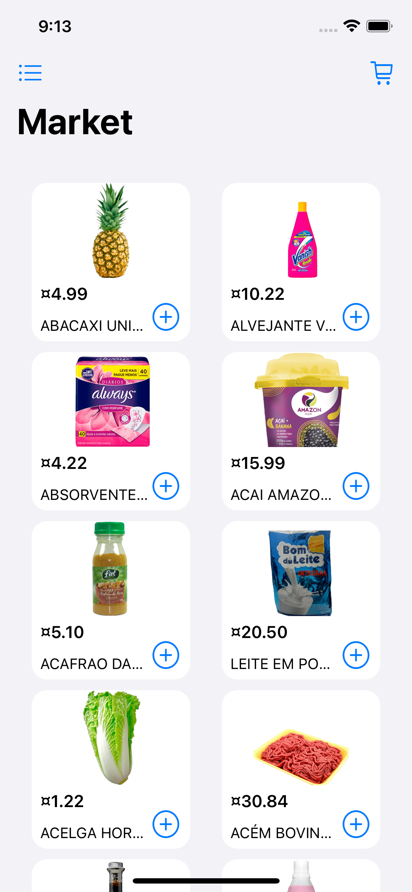
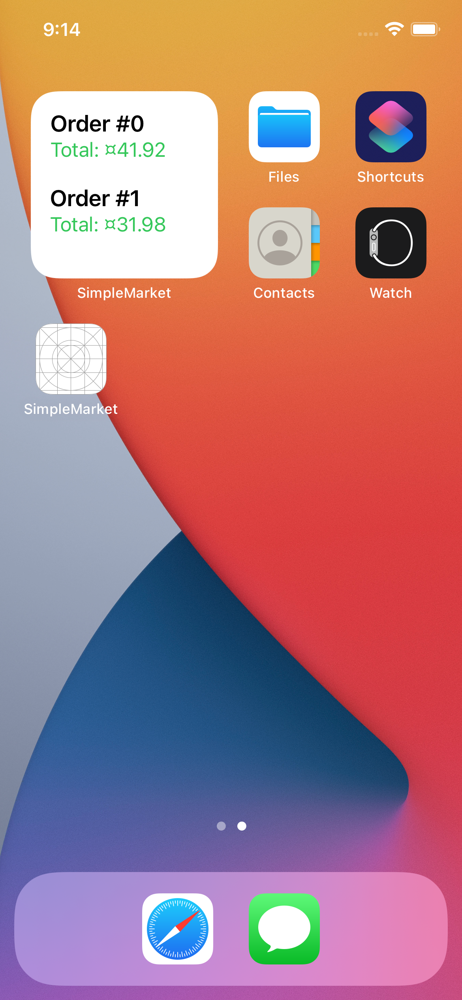

# SimpleMarket
This is an iOS project from a simple market app, it was done using concepts like of MVP-C architecture, DI, SRP and Unit Tests.

## About
This is a market app, where users can add products, remove and create orders.

## Features

### Market View
Lists all products from a sample product API, this is the main view from the project. The user can interact with it by adding products to the cart.

### Cart View
Lists all items detail added on the cart. It shows the amount of each product and the total value of the order. Users can interact with it by adding and removing order items. Also, it's possible to save the order.

### Orders View
Lists all orders created by the user by showing its ID and value. The user can delete all orders created previously (including the current cart).

### Orders Widget
Shows the last 3 orders created on the device's Home Screen. Available only for small size.

## And much more
Besides the features, there are included some other code details, like:
* API consuming
* Realm database
* MVP-C architecture
* Unit Tests
* View Code
* Strings Localization
* CocoaPod and Swift Package Manager dependencies
* SwiftLint rules
* Dark mode support

## How to install

Inside projects folder type a pod install command:

`pod install`

## Screenshots

